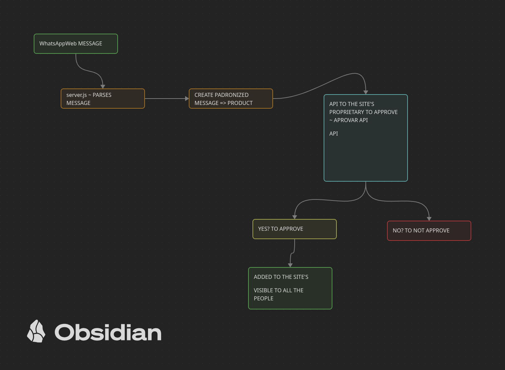

# Loja Leila LL

Um template de uma lojinha online onde implementamos para pessoas leigas na computação que trabalham de maneira informal, como por exemplo com fornecedores que te indicam por WhatsApp quais roupas você se interessa a comprar, para revendar de forma local, na sua própria casa. UFA! BAITA TRABALHÃO! Imagina o número de fornecedores, de clientes a atender, e além do mais, pagamentos ainda não realizados, mesmo após pega do produto. 

## Por que foi criado?

Para realização do projeto 1 da disciplina de Introdução a WEB (SCC0219) lecionada pela professora Bruna Carolina Rodrigues da Cunha.

## Veja o slide próprio para a parte 1, onde respondemos as questões: Quem é nosso cliente? Por que ele precisa disso? 

